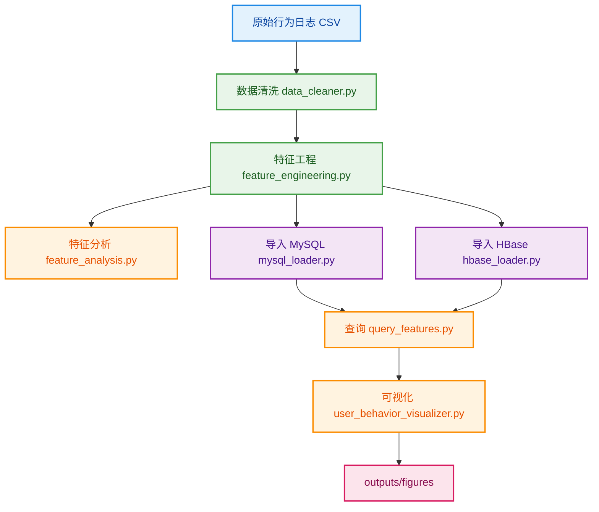
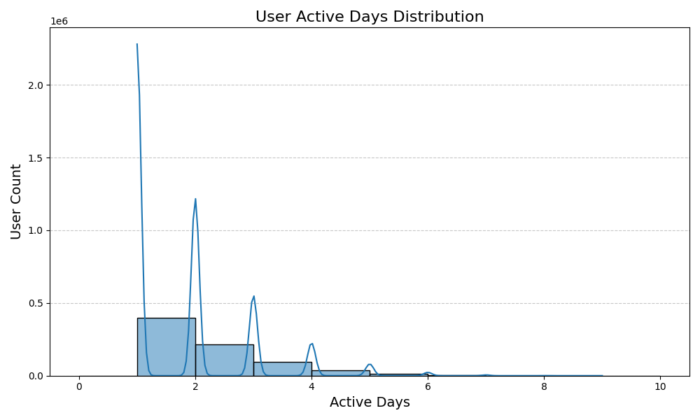
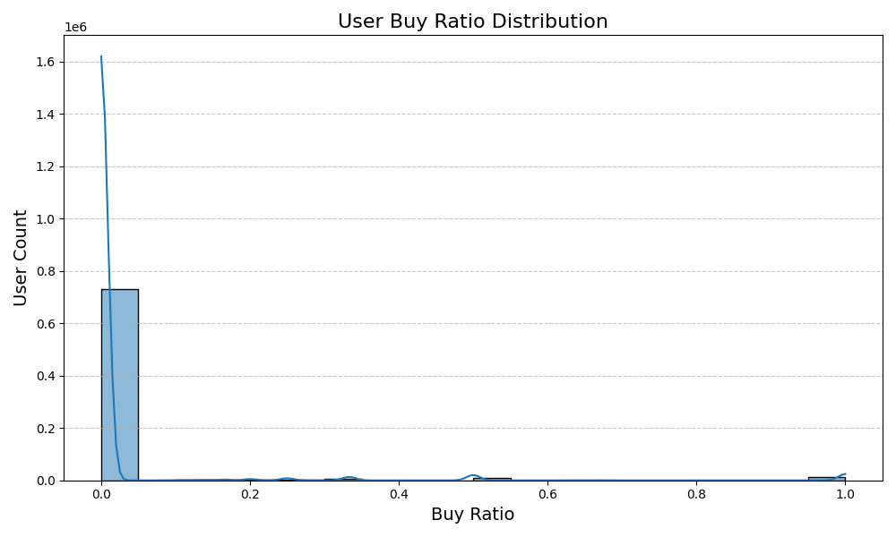
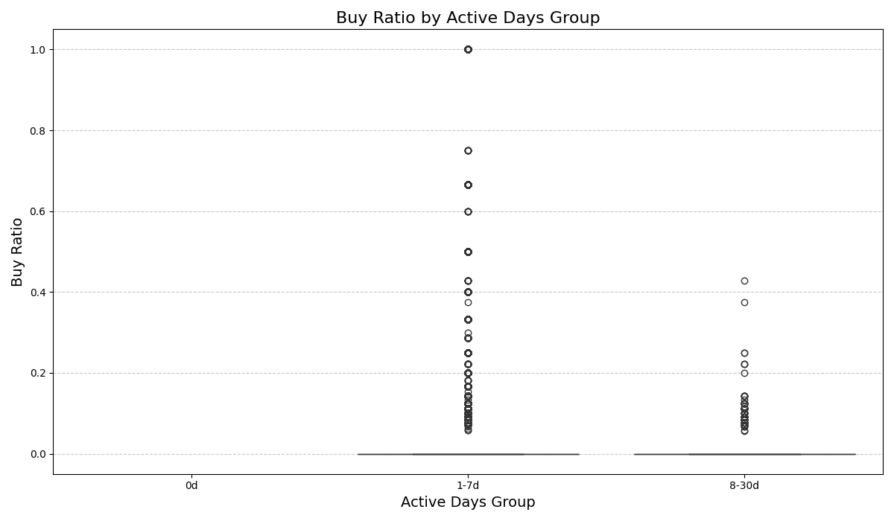
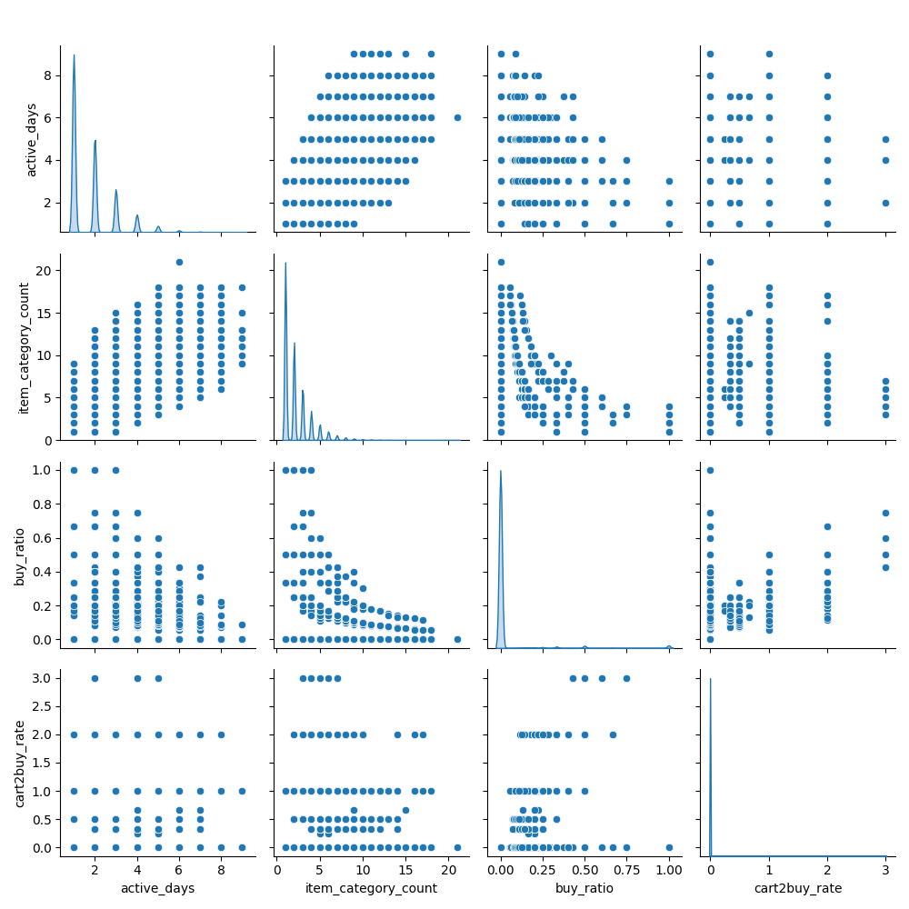

# 用户购物行为分析项目（BigData）

> 基于 **Spark + HDFS + MySQL/HBase** 的用户购物行为分析系统，覆盖数据清洗、特征工程、存储查询和可视化分析全流程。

## 目录

- [项目目标与业务说明](#项目目标与业务说明)
- [快速开始（3条命令）](#快速开始3条命令)
- [项目结构](#项目结构)
- [环境要求](#环境要求)
- [环境变量配置](#环境变量配置)
- [执行流程](#执行流程)
- [输出目录说明](#输出目录说明)
- [可视化结果示例](#可视化结果示例)
- [常见问题与注意事项](#常见问题与注意事项)
- [最近更新（适合提交 GitHub）](#最近更新适合提交-github)

## 项目目标与业务说明

围绕电商用户行为（`pv / cart / fav / buy`）实现：

1. 数据清洗：清除无效、重复、异常数据
2. 特征工程：构建用户活跃度、购买转化、行为间隔等指标
3. 结果存储：支持 MySQL / HBase
4. 结果分析：统计报表 + 可视化图表

业务价值：

- 识别高活跃低转化用户（运营召回）
- 识别高购买倾向用户（精准营销）
- 分析活跃度、品类广度与购买率关系（策略优化）

数据源：

- 阿里云天池用户行为数据集：`https://tianchi.aliyun.com/dataset/649`

## 快速开始（3条命令）

```bash
# 1) 进入项目目录
cd BigData

# 2) 安装依赖
pip install -r requirements.txt

# 3) 从本地数据集导入到 HDFS（按你的路径）
docker cp /home/qintao/Desktop/UserBehavior.csv namenode:/tmp/UserBehavior.csv && docker exec namenode hdfs dfs -mkdir -p /user/behavior/raw && docker exec namenode hdfs dfs -put -f /tmp/UserBehavior.csv /user/behavior/raw/UserBehavior.csv
```

## 项目结构

```text
BigData/
├── README.md
├── requirements.txt
├── src/
│   ├── data_processing/
│   │   ├── data_cleaner.py
│   │   └── feature_engineering.py
│   ├── data_analysis/
│   │   └── feature_analysis.py
│   ├── data_storage/
│   │   ├── mysql_loader.py
│   │   ├── hbase_loader.py
│   │   ├── query_features.py
│   │   └── data_summary.py
│   └── visualization/
│       └── user_behavior_visualizer.py
├── outputs/
│   ├── figures/
│   ├── reports/
│   └── data_samples/
└── 项目说明.md
```

## 环境要求

- Python 3.8+
- Java 8+
- Spark 3.x
- Hadoop 3.x（HDFS 可用）
- MySQL 8.x（可选）
- HBase + Thrift（可选）

## 环境变量配置

> 推荐与当前 Docker 编排环境保持一致。

```bash
export HDFS_RAW_INPUT="hdfs://namenode:9000/user/behavior/raw/UserBehavior.csv"
export HDFS_CLEANED_OUTPUT="hdfs://namenode:9000/user/behavior/cleaned/user_behavior_cleaned"
export HDFS_CLEANED_INPUT="hdfs://namenode:9000/user/behavior/cleaned/user_behavior_cleaned"
export HDFS_FEATURE_OUTPUT="hdfs://namenode:9000/user/behavior/features/user_behavior_features.parquet"
export HDFS_FEATURE_INPUT="hdfs://namenode:9000/user/behavior/features/user_behavior_features.parquet"

export MYSQL_HOST="127.0.0.1"
export MYSQL_PORT="3306"
export MYSQL_USER="hive"
export MYSQL_PASSWORD="hive"
export MYSQL_DATABASE="metastore"

export HBASE_HOST="127.0.0.1"
export HBASE_PORT="9090"
```

## 执行流程



分步命令：

```bash
python src/data_processing/data_cleaner.py
python src/data_processing/feature_engineering.py
python src/data_analysis/feature_analysis.py --sample-limit 1000
python src/data_storage/mysql_loader.py
python src/data_storage/hbase_loader.py
python src/data_storage/query_features.py --db mysql --topn 10 --order_by active_days --desc
python src/visualization/user_behavior_visualizer.py --db mysql --topn 10
```

说明：
- `feature_analysis.py` 与 `user_behavior_visualizer.py` 默认只保存图，不弹出窗口。
- 如需本地弹窗预览，请追加 `--show`。

## 输出目录说明

- `outputs/figures/`：图表产物（PNG）
- `outputs/reports/`：分析文本（如 `feature_analysis_results.txt`）
- `outputs/data_samples/`：样本数据（如 `sample_features.csv`）

## 可视化结果示例

### 用户活跃天数分布



### 购买率分布



### 活跃天数与购买率关系（箱线图）



### 特征相关性总览（Pairplot）



## 常见问题与注意事项

- 请先确认 HDFS、MySQL/HBase 服务可连通再运行脚本。
- 若端口或账号不同，请优先修改环境变量，不建议改源码。
- 图表较多时，README 建议保留 3~6 张代表图，其余放 `outputs/figures/`。

## 最近更新（适合提交 GitHub）

- 统一了默认连接配置：`HDFS` 默认 `hdfs://namenode:9000`，MySQL 默认 `hive/hive@metastore`。
- `feature_engineering.py` 去除不稳定分批方案，改为稳定的单次计算 + 单次写出。
- `mysql_loader.py` / `hbase_loader.py` 去除全量 `toPandas()`，改为按分区写入，降低 Driver 内存压力。
- `feature_analysis.py` 重构为 `main + argparse`，支持 `--show`。
- `user_behavior_visualizer.py` 增加 `--show`（默认仅保存图片）。
- `.gitignore` 已默认忽略 `outputs/**` 与本地环境文件，更适合直接推送 GitHub。

建议发布前自检：

```bash
git status
python src/data_analysis/feature_analysis.py --sample-limit 200
python src/visualization/user_behavior_visualizer.py --db mysql --topn 5
```
