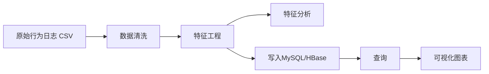

# 用户购物行为分析系统（项目说明版）

> 这份文档是项目实战说明，不是论文。重点是：做了什么、怎么跑、怎么用、结果怎么看。

## 1. 这个项目是干什么的

本项目用于分析电商用户行为数据（`pv/cart/fav/buy`），输出用户特征和可视化结果，帮助做：

- 用户分层（高活跃/低活跃）
- 转化分析（浏览到购买）
- 运营策略参考（召回、促活、精准触达）

技术栈：

- 计算：Spark（PySpark）
- 存储：MySQL / HBase
- 文件系统：HDFS
- 可视化：matplotlib / seaborn

---

## 2. 数据处理流程（实际项目流程）



对应脚本：

- 数据清洗：`src/data_processing/data_cleaner.py`
- 特征工程：`src/data_processing/feature_engineering.py`
- 特征分析：`src/data_analysis/feature_analysis.py`
- MySQL 入库：`src/data_storage/mysql_loader.py`
- HBase 入库：`src/data_storage/hbase_loader.py`
- 查询工具：`src/data_storage/query_features.py`
- 可视化：`src/visualization/user_behavior_visualizer.py`

---

## 3. 目录说明

```text
BigData/
├── README.md
├── requirements.txt
├── src/
│   ├── data_processing/
│   ├── data_analysis/
│   ├── data_storage/
│   └── visualization/
├── outputs/
│   ├── figures/        # 图表输出
│   ├── reports/        # 文本分析输出
│   └── data_samples/   # 样本数据输出
└── 项目说明.md
```

---

## 4. 运行前准备

### 4.1 Python 依赖

```bash
cd BigData
python -m venv bigdata_env
source bigdata_env/bin/activate
pip install -r requirements.txt
```

### 4.2 推荐环境变量（与当前 Docker 环境一致）

```bash
export HDFS_RAW_INPUT="hdfs://namenode:9000/user/behavior/raw/UserBehavior.csv"
export HDFS_CLEANED_OUTPUT="hdfs://namenode:9000/user/behavior/cleaned/user_behavior_cleaned"
export HDFS_CLEANED_INPUT="hdfs://namenode:9000/user/behavior/cleaned/user_behavior_cleaned"
export HDFS_FEATURE_OUTPUT="hdfs://namenode:9000/user/behavior/features/user_behavior_features.parquet"
export HDFS_FEATURE_INPUT="hdfs://namenode:9000/user/behavior/features/user_behavior_features.parquet"

export MYSQL_HOST="127.0.0.1"
export MYSQL_PORT="3306"
export MYSQL_USER="hive"
export MYSQL_PASSWORD="hive"
export MYSQL_DATABASE="metastore"

export HBASE_HOST="127.0.0.1"
export HBASE_PORT="9090"
```

---

## 5. 一次完整跑通（命令顺序）

```bash
# 1) 清洗
python src/data_processing/data_cleaner.py

# 2) 特征工程
python src/data_processing/feature_engineering.py

# 3) 特征分析
python src/data_analysis/feature_analysis.py

# 4) 入库（MySQL）
python src/data_storage/mysql_loader.py

# 5) 入库（HBase，可选）
python src/data_storage/hbase_loader.py

# 6) 查询（示例）
python src/data_storage/query_features.py --db mysql --topn 10 --order_by active_days --desc

# 7) 生成图表
python src/visualization/user_behavior_visualizer.py --db mysql
```

---

## 6. 输出结果去哪看

- 图表：`outputs/figures/`
- 分析文本：`outputs/reports/`
- 样本数据：`outputs/data_samples/`

你可以重点看这些图：

- `active_days_distribution_mysql.png`（活跃度分布）
- `buy_ratio_distribution_mysql.png`（购买率分布）
- `active_days_vs_buy_ratio_boxplot_mysql.png`（活跃度与购买率关系）
- `pairplot_features_mysql.png`（主要特征关系）

---

## 7. 当前已知情况（实话实说）

- MySQL 流程已能跑通，适合作为默认查询与可视化数据源。
- HBase 依赖 Thrift 服务，若未启动会连接失败（先排服务再跑脚本）。
- 该项目目前是离线分析链路，不是实时流处理系统。

---

## 8. GitHub 展示建议

如果你要放到 GitHub，建议保持以下结构：

1. 根目录 `README.md` 讲整体架构（环境 + 子项目）
2. `BigData/README.md` 讲运行步骤
3. 本文档保留“项目实践说明”视角（不写成论文）
4. 图表统一放 `outputs/figures`，README 只展示 3~6 张代表图

---

## 9. 后续可扩展方向

- 接入实时流处理（Kafka + Spark Streaming/Flink）
- 加入用户价值评分与分群模型
- 将可视化改成 Web Dashboard（如 Streamlit）
- 增加自动化任务调度（Airflow）
